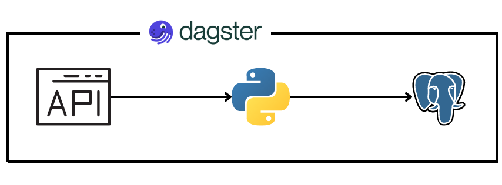

# GivewaysETL_Dagster

## Table of contents:

1. [Description](#Description)
2. [Tools](#Tools)
3. [Getting started](#getting-started)
   - [Dagster UI](#dagster-ui)
   - [PostgreSQL database](#postgresql-database)

## Description

This project is a small implementation of the Dagster orchestration tool into a data pipeline. The data flow consists of retrieving data from the CheapsharkAPI, processing it using Python scripts, and storing it in a PostgreSQL database.



## Tools

The following tools are used in this project:

* CheapsharkAPI: An API for retrieving data related to video game prices and deals.
* PostgreSQL: A powerful open-source relational database management system.
* Python: A popular programming language used for data processing and manipulation.
* Dagster: An open-source data orchestrator for building and managing data pipelines.
* Docker: A platform for creating and managing containers to isolate and run applications.

## Getting started

1. First clone project repository:

```bash
git clone <https://github.com/FireLegMM/GivewaysETL_Dagster.git>
```

2. Go into main project directory:

```bash
cd Giveways
```
3. Build and start the Docker containers using docker-compose:

Note: It is highly recommended to start this project using Docker containers. Running the project without Docker containers may result in errors during pipeline execution due to configuration issues. Docker provides a standardized and isolated environment for running the project, ensuring consistent and reproducible results.

```bash
docker-compose up -d
```

4. Once the containers are up and running, you can access the project within the Docker environment.

### Dagster UI
To access Dagster web-based interface use:
```html
http://localhost:3000
```

### PostgreSQL database
Default database connection credentials:
```python
USERNAME = "dagster"
PASSWORD = "dagster"
DATABASE_HOST = "localhost"
PORT = "5432"
DATABASE_NAME = "db_wh"
```
